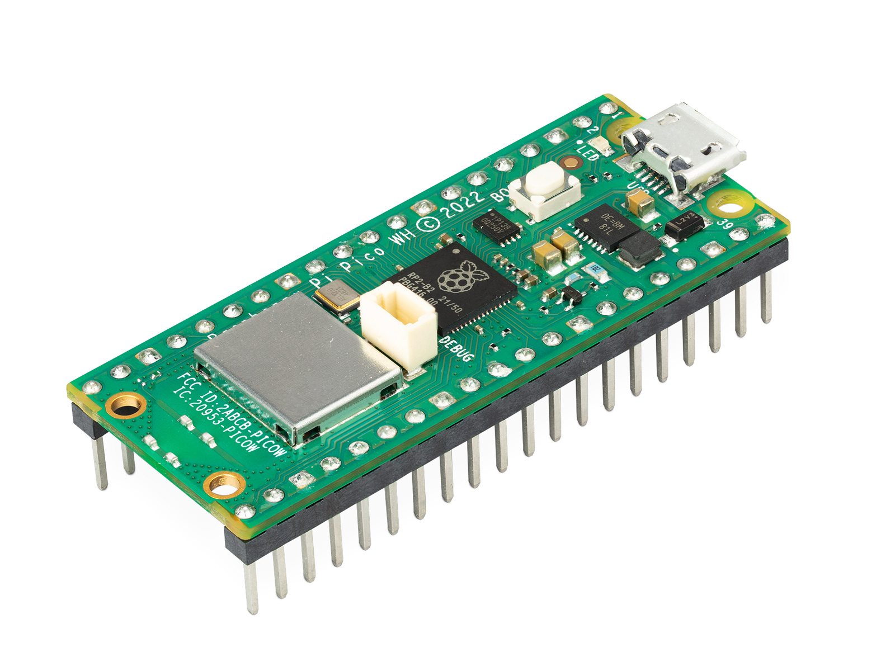
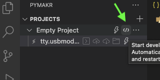

# Light, humidity and temperature sensor
Tom Enqvist\
te222qz

This project will demonstarte how to measure light, temperature and humidity using dht11 sensors and photo resistors. To make it somewhat more reliable for use with action triggers, the readings are averaged and over time and by using 2 of each sensor. Outlier readings are also disregarded when calculating the average.

Temperature, humidity, light values and darkness percentage are sent to io.adafruit.com for vizualisation and logging.

It will take aproximately 3 hours to complete given no problems are encountered during software and hardware installation.

## Objective

The main reason I've choosen this project to learn how to use the dht11 sensor and photo reistor. During the making of the project I found out the sensors (especially the photo reistor) sometimes reported readings that would differ far too much from what was expected. These spikes in the reading could make the data "noisy" and unwantedly trigger actions. So, a secondary reason I've choosen this project is to try to make the readings more reliable for this usecase.

The purpose of the project is to report and log light, humidity and temperature values, and based on these values trigger actions via webhooks.

This project will give insight on the environment it is placed in. In my case, I've placed it on my balcony to gain insight on sunset and sundown timings and corresponding temperature and humidity level.

## Material

The sensor used are DHT11 and a photo resistor.

DHT11 is a digital humidity and temperature sensor with a measurement range of 20 to 90 Relative humidity and 0 - 50°C.
The photoresistor module conists of a photo resistor and 10 kΩ in-line resistor. It has a analogue output and the resistance of the photoresistor will decrease in the presence of light.

|| Material | Cost | |
|-| --- | -------- | - |
||Raspberry Pi Pico WH| 109 SEK | [link](https://www.electrokit.com/produkt/raspberry-pi-pico-wh/)|
|| DHT11 |  49 SEK |[link](https://www.electrokit.com/produkt/digital-temperatur-och-fuktsensor-dht11/)|
||  Photo Resistor | 39 SEK | [link](https://www.electrokit.com/produkt/ljussensor/)
||Breadboard 840 connections | 69 SEK |[link](https://www.electrokit.com/produkt/kopplingsdack-840-anslutningar/)
||Jumper cables (Male to male)| 29 SEK| [link](https://www.electrokit.com/produkt/labbsladd-20-pin-15cm-hane-hane/)
||USB cable| 39 SEK |[link](https://www.electrokit.com/produkt/usb-kabel-a-hane-micro-b-5p-hane-1-8m/)

Explain all material that is needed. All sensors, where you bought them and their specifications. Please also provide pictures of what you have bought and what you are using.

- List of material
- What the different things (sensors, wires, controllers) do - short specifications
- Where you bought them and how much they cost

## Computer setup

For the purpose of this project I have used Visual Studio as my IDE with the pymakr plugion. And for programming the pico I'm using micropython

### Update the firmware

- Download micropython for [Pico W](https://micropython.org/download/rp2-pico-w/).
- Hold down the BOOTSEL button of the pico and connect it to the computer with a USB cable.
- Copy the uf2 file to the pico mass storage.

### Installing IDE and plugins

- Download and install [Visual Studio Code](https://code.visualstudio.com)
- Download and install [Node.js](https://nodejs.org/en)
- In VSCode, search for "pymakr" in the Extension tab and install it.

### Program and upload to Pico

- Go to the pymakr tab
- Click on create new project and choose or creat a folder for the project
- Click on Add device to add your pico top the project.
- Click on the lightning icon (1) to connect the pico and then create a terminal (2).

  
- Start development mode by clicking <\>. The files should now be uploaded to the pico everytime you save your project.
  
  

## Putting everything together

Connect the sensors to the pico using this diagram:

  

The photo resistors must be connected a ADC pin (GP26, GP27, GP28)\
DHT11 can be connected to any GP pin. In the diagram they are connected to GP16 and GP17.

Negative on the sensors should på connected to a GND pin and positive to the 3V3(OUT) pin.

## Platform

My platform of choice is [Adafruit](https://io.adafruit.com) since it's really easy to use. The pico connects to the platform via MQTT and can be used to create a dashboard to monitor the sensor values in real time and over time. Actions can be created that are triggered by the sensor values or they can be scheduled.

I'm using the free tier so data can be sent 30 times each minute. For this project it is sufficient.

## The code

### Connecting to a network

The boot.py file makes sure the pico is connected to a network using Wifi. SSID and passwords are stored in secrets.py

https://github.com/tomenqvist/project_v2/blob/651fe7cd284308049c1e42ea8408e6b2f0e07ca0/src/boot.py#L1-L51

### Sensors
In the sensors.py file we need to first import necessary libraries and create and populate our queues for storing sensor values

https://github.com/tomenqvist/project_v2/blob/651fe7cd284308049c1e42ea8408e6b2f0e07ca0/src/sensors.py#L1-L27

We also need to implement functions for dealing with queues (the deque library did not work for me)

https://github.com/tomenqvist/project_v2/blob/651fe7cd284308049c1e42ea8408e6b2f0e07ca0/src/sensors.py#L124-L129

This is the function for reading and calculating mean light values:

https://github.com/tomenqvist/project_v2/blob/651fe7cd284308049c1e42ea8408e6b2f0e07ca0/src/sensors.py#L54-L120

The light values of each sensor are stored in the queue, and then a sorted copy of the are created from which the mean value are calculated from position 2 to 7, meaning outliers (position 0, 1, 7 and 8) are disregarded. Then the mean value of those two values are calculated and returned. 

The darkness percentage are also calculated by using the min and max light value from the last 7 days.

*The function for reading values from the DHT11 sensor works in basically the same way*

### Main

First we need to import libraries and set user, password, key and paths to adafruit topics and at waht rate we want to send the data. 

**Remenber to include the mqtt.py file in your project since MQTT is used to send data to adafruit**

https://github.com/tomenqvist/project_v2/blob/651fe7cd284308049c1e42ea8408e6b2f0e07ca0/src/main.py#L1-L25

Then we create a function for sending the data, and finally we run an infinite loop that calls the sensor and send_data functions:

https://github.com/tomenqvist/project_v2/blob/651fe7cd284308049c1e42ea8408e6b2f0e07ca0/src/main.py#L27-L74

## Transmitting the data / connectivity

How is the data transmitted to the internet or local server? Describe the package format. All the different steps that are needed in getting the data to your end-point. Explain both the code and choice of wireless protocols.

- How often is the data sent?
- Which wireless protocols did you use (WiFi, LoRa, etc …)?
- Which transport protocols were used (MQTT, webhook, etc …)

## Presenting the data

Describe the presentation part. How is the dashboard built? How long is the data preserved in the database?

- Provide visual examples on how the dashboard looks. Pictures needed.
- How often is data saved in the database.

## Finalizing the design

Show the final results of your project. Give your final thoughts on how you think the project went. What could have been done in an other way, or even better? Pictures are nice!

- Show final results of the project
- Pictures
